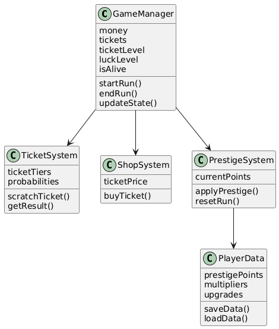
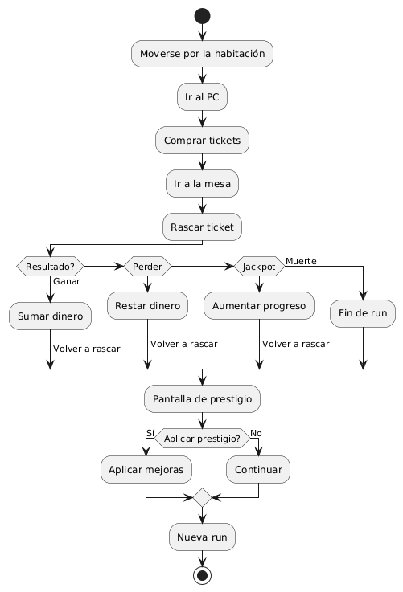

# 02_model_del_joc.md

## 1. Components principals del joc

El sistema del joc es divideix en diversos components principals:

* GameManager → controla l’estat general de la partida (run)
* TicketSystem → gestiona els tiquets i els resultats
* ShopSystem → permet comprar tiquets
* PrestigeSystem → gestiona el prestigi i el reset de la partida
* PlayerData → guarda les dades del jugador entre runs

---

## 2. Entitats identificades

Les entitats principals del sistema són:

* GameManager
* TicketSystem
* ShopSystem
* PrestigeSystem
* PlayerData

---

## 3. Atributs clau de cada entitat

### GameManager

* money
* tickets
* ticketLevel
* luckLevel
* isAlive

### TicketSystem

* ticketTiers
* probabilities

### ShopSystem

* ticketPrice

### PrestigeSystem

* currentPoints

### PlayerData

* prestigePoints
* multipliers
* upgrades

---

## 4. Accions, mètodes o funcions principals

### GameManager

* startRun()
* endRun()
* updateState()

### TicketSystem

* scratchTicket()
* getResult()

### ShopSystem

* buyTicket()

### PrestigeSystem

* applyPrestige()
* resetRun()

### PlayerData

* saveData()
* loadData()

---

## 5. Explicació del diagrama de classes

A continuació es mostra el diagrama de classes del sistema:



🔗 [Obrir imatge](../img/diagrama_classes.png)

Aquest diagrama mostra les entitats principals i les relacions entre els diferents sistemes del joc.

---

## 6. Explicació del diagrama de comportament

A continuació es mostra el diagrama de comportament del joc:



🔗 [Obrir imatge](../img/diagrama_comportament.png)

Aquest diagrama representa el flux del joc des de l’inici fins al final de la run i el sistema de prestigi.

---

## 7. Correspondència entre diagrames i codi futur

Cada classe es convertirà en un script dins de Roblox:

* GameManager → control general del joc
* TicketSystem → lògica de probabilitats
* ShopSystem → compra de tiquets
* PrestigeSystem → sistema de prestigi
* PlayerData → dades persistents

---

## 8. Estructura inicial del repositori

```
/projecte-joc
│
├── docs/
│   └── 02_model_del_joc.md
│
├── img/
│   ├── diagrama_classes.png
│   └── diagrama_comportament.png
│
├── src/
│
└── README.md
```

## 9. Primer commit i README inicial

El primer commit inclourà:

* estructura del projecte
* carpeta docs
* carpeta img
* README.md

El README explicarà el joc i la seva estructura.

---
